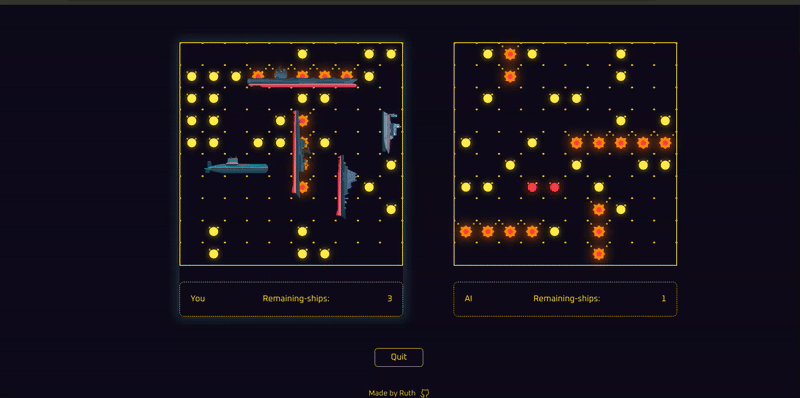

# 🛳️ Battleship Game

## 🚀 Live Demo

Play it online:
[https://ruthzu.github.io/battleship](https://ruthzu.github.io/battleship)

---

A classic **Battleship game** built with **JavaScript**, **HTML**, and **CSS**, featuring dynamic board rendering, hit detection, and turn-based gameplay between the player and computer.

Sink all enemy ships before yours go down!

---

## 🎮 Game Overview

**Battleship** is a two-player strategy game where each player hides ships on a grid and takes turns firing shots to locate and destroy the opponent’s fleet.

### 🧩 Core Features

- **Ship Placement System:**
  Dynamically places ships of various lengths on the grid, ensuring no overlap.
- **Attack & Hit Detection:**
  Handles user and AI attacks, marking hits and misses visually.
- **Game Logic Control:**
  Manages player turns, win conditions, and board updates in real time.
- **Interactive UI:**
  Hover effects and animations for placing and attacking ships.
- **Modular Codebase:**
  Organized with pure functions for ship, board, and player logic.

---

## ⚙️ How the Game Works

1. **Gameboard Initialization**
   Each player has a 10×10 grid represented as a two-dimensional array.
2. **Ship Placement**

   - Ships are created from a **Ship Factory** function with properties like length and hit count.
   - Ships are placed on valid coordinates with horizontal or vertical orientation.

3. **Attacks**

   - The player selects a square on the enemy board.
   - The board checks if a ship occupies that position and updates the state to **hit** or **miss**.

4. **Computer Moves**

   - The computer makes random (or strategic) attacks on untried coordinates.

5. **Win Condition**

   - When all ships in one fleet are sunk, the game ends and the winner is announced.

---

## 🧠 Game Architecture

| Module                | Responsibility                                            |
| --------------------- | --------------------------------------------------------- |
| **Ship.js**           | Creates ship objects, tracks hits, and checks if sunk.    |
| **Gameboard.js**      | Manages ship placement, attacks, and hit detection.       |
| **Player.js**         | Handles player and computer turns.                        |
| **index.js / DOM.js** | Manages UI updates, board rendering, and event listeners. |

---

## 🛠️ Built With

- **JavaScript (ES6+)**
- **HTML5 / CSS3**
- **Webpack** (for bundling and dev server)
- **PostCSS + Autoprefixer** (for cross-browser styling)

---
